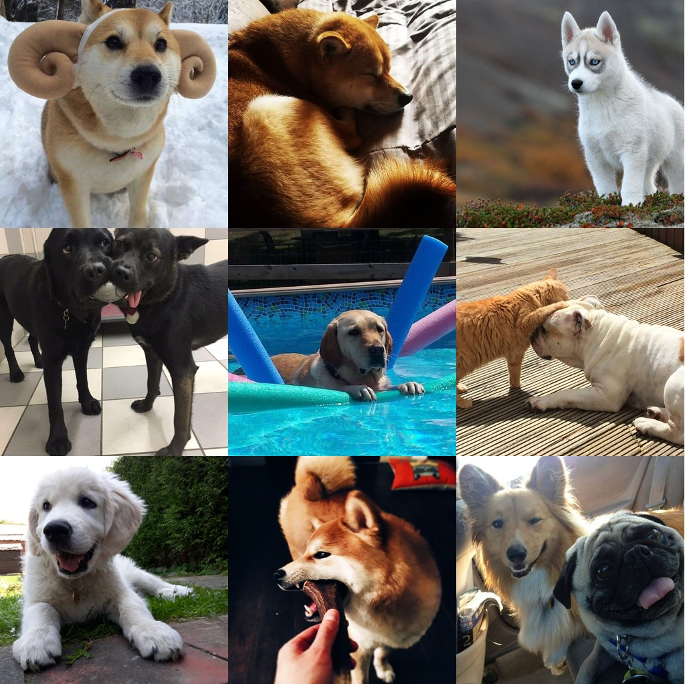

# Dog Collage Generator

Fetches 9 random dog images and combines them into a 3×3 collage.



## What it demonstrates

| Concept | How it's used |
|---------|---------------|
| **Rate limiting** | API calls limited to 10/min |
| **Dependencies** | `download_image` waits for `fetch_url` to create URL artifact |
| **Aggregation** | `create_collage` waits for all 9 images to download |
| **Artifact checks** | `is_ready` checks if input files exist |
| **Skip logic** | `is_stale` skips work if output already exists |

## Task flow

```
fetch_url (×9)  →  download_image (×9)  →  create_collage (×1)
     │                    │                       │
     ▼                    ▼                       ▼
 url_0.json          dog_0.jpg              collage.jpg
 url_1.json          dog_1.jpg
 ...                 ...
```

## Run it

```bash
# Install dependencies
pip install runcue httpx pillow

# Run
python main.py
```

## Output

```
🐕 Dog Collage Generator
   Fetching 9 random dog images...

  [slot 0] Got URL: https://random.dog/abc123.jpg...
  [slot 1] Got URL: https://random.dog/def456.jpg...
  [slot 0] Downloaded: dog_0.jpg
  ...
  Creating collage...
  ✓ Collage saved: output/collage.jpg

✓ Done! Open output/collage.jpg
```

## Re-running

Run again and it skips already-completed work:

```bash
# Delete one image to trigger re-download
rm output/dog_3.jpg

# Run again - only fetches and downloads slot 3
python main.py
```

