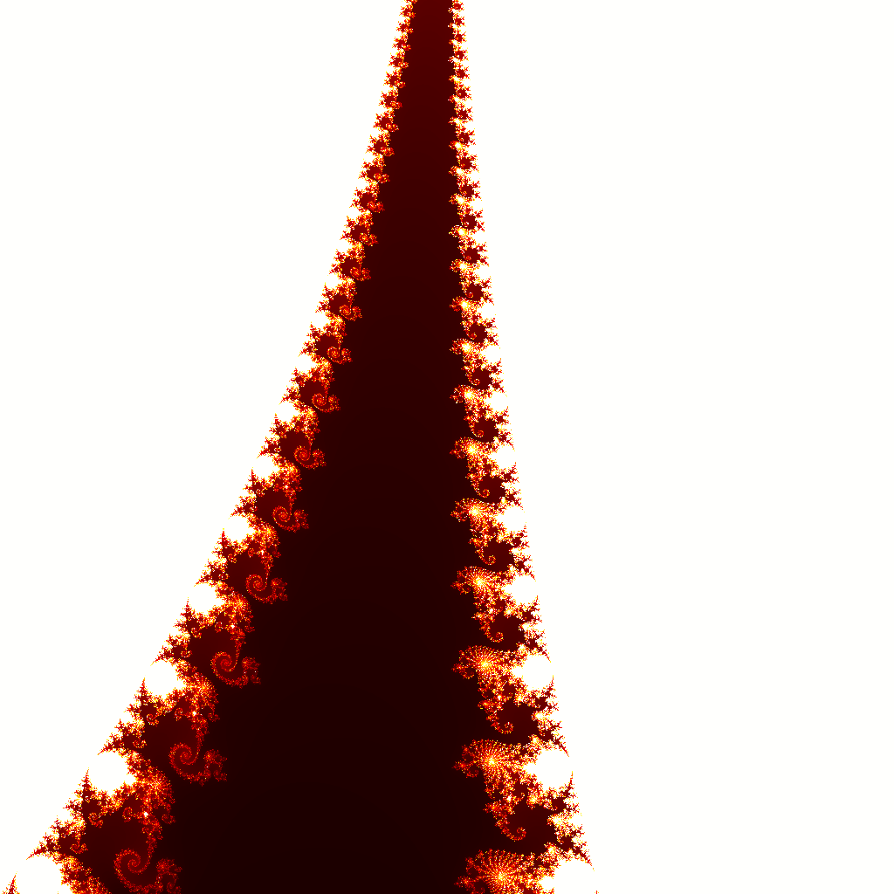

# Mandelbrot Fractal Generator

Generates a Mandelbrot set image using parallel tile computation.



## What it demonstrates

| Concept | How it's used |
|---------|---------------|
| **Concurrency limits** | `cue.service("compute", concurrent=4)` - limit CPU parallelism |
| **Parallel execution** | Tiles computed in parallel up to worker limit |
| **Dependencies** | `stitch_tiles` waits for all tiles via `is_ready` |
| **Artifacts** | Each tile saved as separate image |
| **Skip logic** | `is_stale` skips already-computed tiles |

## Task flow

```
compute_tile (0,0)  ──┐
compute_tile (1,0)  ──┤
compute_tile (2,0)  ──┤
...                   ├──→  stitch_tiles  ──→  mandelbrot.png
compute_tile (2,3)  ──┤
compute_tile (3,3)  ──┘
     (16 tiles)
```

## Run it

```bash
# Install dependencies
pip install runcue pillow numpy matplotlib

# Default: 2048×2048, 256 iterations, 4×4 grid
python main.py

# High resolution
python main.py --size 4096 --iter 512

# More parallelism (8×8 = 64 tiles, 8 workers)
python main.py --grid 8 --workers 8

# Zoom into interesting region (use = for negative values)
python main.py --zoom=-0.75,0.1,0.01

# Different colormap (built-in: fire, ocean, neon, electric, plasma, grayscale)
python main.py --colormap fire
python main.py --colormap neon
```

## Options

| Option | Default | Description |
|--------|---------|-------------|
| `--size` | 2048 | Output image size (pixels) |
| `--iter` | 256 | Max iterations per pixel |
| `--grid` | 4 | Tile grid size (grid × grid) |
| `--workers` | 4 | Max parallel compute workers |
| `--zoom` | - | Zoom: `center_x,center_y,scale` |
| `--colormap` | fire | Color scheme (fire, ocean, neon, electric, plasma, grayscale) |

## Output

```
🌀 Mandelbrot Fractal Generator
   Size: 2048×2048, Iterations: 256
   Grid: 4×4 (16 tiles), Workers: 4
   Region: x=[-2.0000, 1.0000], y=[-1.5000, 1.5000]

  [ 1/16] W1 → Tile (0,0) done - 6% (0.8s)
  [ 2/16] W2 → Tile (0,1) done - 12% (0.9s)
  [ 3/16] W3 → Tile (0,2) done - 19% (1.0s)
  [ 4/16] W4 → Tile (0,3) done - 25% (1.1s)
  [ 5/16] W1 → Tile (1,0) done - 31% (1.4s)
  ...
  [16/16] W4 → Tile (3,3) done - 100% (4.2s)
  Stitching tiles...
  ✓ Saved: output/mandelbrot.png (4.3s total)

✓ Done! Open output/mandelbrot.png
```

## Interesting zoom locations

```bash
# Seahorse valley
python main.py --zoom=-0.75,0.1,0.05 --iter 512

# Spiral
python main.py --zoom=-0.761574,-0.0847596,0.001 --iter 1000

# Mini Mandelbrot
python main.py --zoom=-1.768778833,-0.001738996,0.0001 --iter 2000
```

