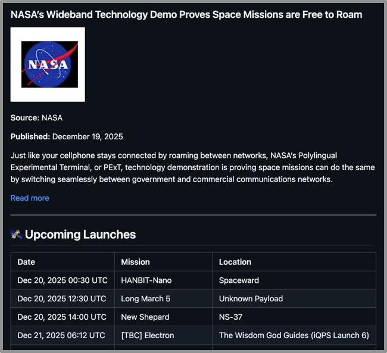

# Space News Dashboard

Fetches space news, downloads article images, retrieves upcoming launches,
and generates a markdown report.



## What it demonstrates

| Concept | How it's used |
|---------|---------------|
| **Multiple APIs** | Spaceflight News API + Space Devs Launch Library |
| **Rate limiting** | Different limits per service (30/min vs 15/min) |
| **Parallel fetching** | Articles and launches fetch concurrently |
| **Dependencies** | Thumbnails wait for images, report waits for everything |
| **Data aggregation** | Combines multiple sources into single report |
| **Pending timeout** | Auto-fail if work stuck > 60s (prevents infinite hangs) |

## Task flow

```
                    ┌─────────────────┐
                    │  fetch_articles │
                    └────────┬────────┘
                             │
              ┌──────────────┼──────────────┐
              ▼              ▼              ▼
        download_image  download_image  download_image (×5)
              │              │              │
              ▼              ▼              ▼
       create_thumbnail create_thumbnail create_thumbnail
              │              │              │
              └──────────────┼──────────────┘
                             │
┌──────────────┐             │
│fetch_launches├─────────────┤
└──────────────┘             │
                             ▼
                    ┌─────────────────┐
                    │ generate_report │
                    └─────────────────┘
```

## Run it

```bash
# Install dependencies
pip install runcue httpx pillow

# Run
python main.py
```

## Output

```
🚀 Space News Dashboard Generator
   Fetching 5 articles + upcoming launches

  Fetching news articles...
  Fetching upcoming launches...
  ✓ Got 5 articles
  ✓ Got 15 upcoming launches
  [article 0] Downloaded image
  [article 1] Downloaded image
  [article 0] Created thumbnail
  ...
  Generating report...
  ✓ Report saved: output/report.md

✓ Done! Open output/report.md
```

## Generated files

```
output/
├── articles.json      # Raw article data
├── launches.json      # Parsed launch data
├── launches.ics       # Raw ICS calendar
├── image_0.jpg        # Original article images
├── image_1.jpg
├── ...
├── thumb_0.jpg        # Thumbnails (200×150)
├── thumb_1.jpg
├── ...
└── report.md          # Final markdown report
```

## APIs used

- [Spaceflight News API](https://spaceflightnewsapi.net/) - Space news aggregator
- [The Space Devs Launch Library 2](https://thespacedevs.com/llapi) - Launch schedule data

